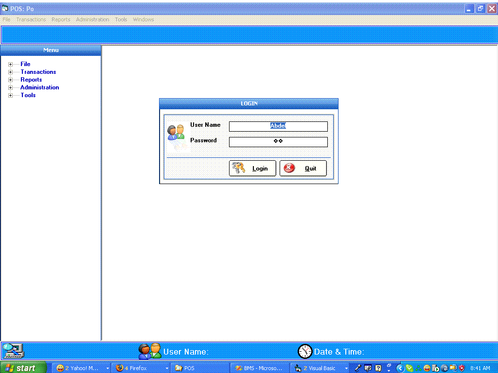



## Point Of Sale

### Description

This a Point Of Sale Application that I developed for a friend that sells building materials, to manage his shops.

I decided to post it in order to get more suggestions from programmers to make it better.

I hope everybody be it beginner, intermediate or advanced will enjoy it and vote for me.

I used SQL Server 2000 and Crystal Report 8.5
 
### More Info
 
I used SQL Server 2000 and Crystal Report 8.5

I used SQL Server 2000 and Crystal Report 8.5

             |
---                |---
**Submitted On**   |2008-02-07 08:47:34
**By**             |[YESSOUFOU ABDEL RAOUF](https://github.com/Planet-Source-Code/PSCIndex/blob/master/ByAuthor/yessoufou-abdel-raouf.md)
**Level**          |Intermediate
**User Rating**    |4.7 (71 globes from 15 users)
**Compatibility**  |VB 6\.0
**Category**       |[Complete Applications](https://github.com/Planet-Source-Code/PSCIndex/blob/master/ByCategory/complete-applications__1-27.md)
**World**          |[Visual Basic](https://github.com/Planet-Source-Code/PSCIndex/blob/master/ByWorld/visual-basic.md)
**Archive File**   |[Point\_Of\_S210101282008\.zip](https://github.com/Planet-Source-Code/yessoufou-abdel-raouf-point-of-sale__1-70060/archive/master.zip)

